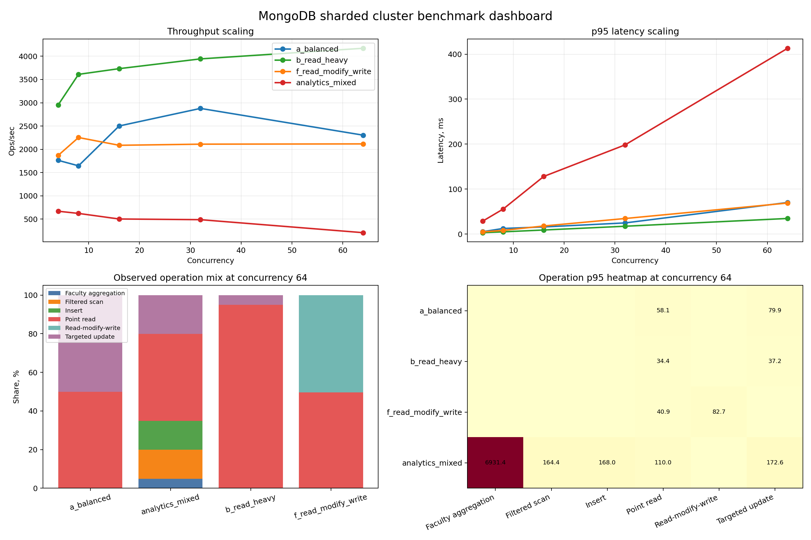

# Павел Брагин - База данных студентов с шардингом

## 1. Цель работы

Цель проекта - спроектировать и реализовать нереляционную базу данных для хранения информации о студентах университета, поддержать горизонтальное масштабирование через шардинг, разработать простой Python-интерфейс и провести нагрузочное тестирование.

## 2. Выбранный стек

- `MongoDB 7` как документо-ориентированная NoSQL СУБД
- `Docker Compose` для развёртывания распределённого кластера
- `Python 3` и `PyMongo` для клиентского приложения
- `matplotlib` и `pandas` для визуализации результатов нагрузочного теста

## 3. Описание схемы базы данных

В проекте используется база данных `university` и коллекция `students`.

Каждый документ описывает одного студента и хранит:

- идентификатор студента;
- ФИО;
- факультет и образовательную программу;
- номер группы и курс обучения;
- контактные данные;
- средний балл `GPA`;
- текущий статус обучения;
- массив записей о зачислении на дисциплины.

Пример документа:

```json
{
  "_id": "S000001",
  "student_id": "S000001",
  "full_name": "Anna Petrova",
  "faculty": "Computer Science",
  "program": "Data Engineering",
  "year": 2,
  "group_number": "CS-24",
  "contacts": {
    "email": "s000001@university.local"
  },
  "gpa": 4.6,
  "status": "active",
  "enrollments": [
    {
      "course_code": "DB101",
      "title": "Databases",
      "semester": "2025-autumn",
      "credits": 4,
      "grade": "A"
    }
  ],
  "created_at": "2026-03-18T00:00:00Z",
  "updated_at": "2026-03-18T00:00:00Z"
}
```

### Почему выбрана документо-ориентированная модель

- данные о студенте логично объединяются в один документ;
- большинство операций выполняется по одному студенту;
- вложенный массив `enrollments` позволяет хранить учебную историю без сложных `JOIN`;
- модель легко расширяется дополнительными полями.

## 4. Реализация шардинга

### Топология

Кластер состоит из:

- `cfgsvr1` - config server;
- `shard1a` - первый шард;
- `shard2a` - второй шард;
- `mongos` - роутер, через который работают Python-скрипты;
- `replset-init` и `sharding-init` - сервисы начальной настройки.

### Настройка

При запуске `docker compose up -d` выполняются следующие шаги:

1. Поднимаются все узлы MongoDB.
2. Для config server и каждого шарда инициализируются `replica set`.
3. Шарды регистрируются в `mongos`.
4. Для базы `university` включается шардинг.
5. Коллекция `students` шардируется по ключу `{ _id: "hashed" }`.

### Обоснование выбора shard key

В качестве ключа шардинга выбран `_id` в hashed-виде:

```javascript
sh.shardCollection("university.students", { _id: "hashed" })
```

Причины выбора:

- идентификатор студента уникален;
- операции чтения и обновления чаще всего адресуются по `student_id`;
- hashed-ключ равномерно распределяет документы между шардами;
- снижается риск перекоса данных и hotspot-эффекта.

Такой подход особенно полезен для массовой параллельной нагрузки, когда в систему поступают тысячи запросов на чтение и обновление по разным студентам.

## 5. Python-интерфейс

Реализован консольный интерфейс `src/university_cli.py` с командами:

- `add-student` - добавить студента;
- `get-student` - получить студента по идентификатору;
- `list-students` - вывести список студентов с фильтрами;
- `update-gpa` - обновить средний балл;
- `add-enrollment` - добавить дисциплину;
- `faculty-stats` - получить агрегированную статистику по факультетам.

Пример запуска:

```bash
python3 -m src.university_cli get-student --student-id S000120
```

Интерфейс подключается не к отдельному узлу, а к `mongos`, то есть клиент работает с распределённой системой прозрачно.

## 6. Нагрузочное тестирование

### Подготовка

Перед тестом в коллекцию загружаются синтетические данные:

```bash
python3 scripts/seed_data.py --count 10000
```

### Методика

Для тестирования используется скрипт `scripts/benchmark.py` с:

- фазой прогрева (`warmup`) перед измерениями;
- 4 профилями нагрузки: `a_balanced`, `b_read_heavy`, `f_read_modify_write`, `analytics_mixed`;
- Разбиение по уровням параллелизма: `4, 8, 16, 32, 64`;
- повторами каждого сценария (`repeats=3`) для снижения влияния случайных флуктуаций;
- сбором метрик `throughput`, `avg`, `p95`, `p99`, `max` и `error rate`.

Описание профилей нагрузки:

- `a_balanced`: смесь примерно 50% точечных чтений по конкретному студенту и 50% точечных обновлений (обновление полей студента).
- `b_read_heavy`: чтения доминируют (примерно 95% точечных чтений и 5% точечных обновлений) — это профиль для проверки “сколько чтений кластер переваривает”.
- `f_read_modify_write`: профиль “прочитал — изменил — записал” (примерно 50% точечных чтений с последующим обновлением и 50% аналогичных операций), он сильнее нагружает кластер по сравнению с чистыми update/read.
- `analytics_mixed`: наиболее “прикладной” смешанный профиль — включает insert (добавление студентов), `filtered_scan` (выборку по факультету) и `faculty_aggregation` (агрегацию по факультетам)

Команда запуска:

```bash
python3 scripts/benchmark.py \
  --operations-per-run 20000 \
  --warmup-operations 3000 \
  --concurrency-levels 4,8,16,32,64 \
  --repeats 3
```

### Артефакты

Скрипт сохраняет:

- `benchmark_results/benchmark_summary.csv`
- `benchmark_results/benchmark_runs.csv`
- `benchmark_results/benchmark_operation_breakdown.csv`
- `benchmark_results/benchmark_operation_summary.csv`
- `benchmark_results/throughput_vs_concurrency.png`
- `benchmark_results/latency_vs_concurrency.png`
- `benchmark_results/throughput_latency_tradeoff.png`
- `benchmark_results/operation_latency_heatmap.png`
- `benchmark_results/benchmark_dashboard.png`

### Результаты и интерпретация

Ключевые значения из `benchmark_results/benchmark_summary.csv` (среднее по 3 повторам):

| Workload | Лучшая пропускная способность (c) | p95, ms | p99, ms | error rate, % |
|---|---:|---:|---:|---:|
| `a_balanced` | 2878.47 (c=32) | 24.67 | 38.41 | 0.00 |
| `b_read_heavy` | 4170.39 (c=64) | 34.59 | 50.03 | 0.00 |
| `f_read_modify_write` | 2115.85 (c=64) | 68.92 | 115.55 | 0.00 |
| `analytics_mixed` | 669.39 (c=4) | 28.70 | 65.62 | 3.52 |

Выводы по тесту:

- `b_read_heavy` дает лучшие tail-метрики на фоне остальных сценариев (в измерениях ошибок не наблюдалось, error rate = `0.0%`);
- при росте конкуренции у `a_balanced` пропускная способность растет до `c=32`, после чего начинает снижаться, при этом `p95/p99` увеличиваются из-за конкуренции за ресурсы и очередей;
- `analytics_mixed` (insert + filtered scan + aggregation) демонстрирует существенное падение пропускной способности при росте конкуренции и при `c=4` показывает ненулевой error rate (`3.52%`), что может быть связано с нагрузкой на write/aggregation части пайплайна;
- `f_read_modify_write` показывает рост tail latency с увеличением конкуренции (наибольшие хвосты при `c=64`), при этом ошибок в измерениях не фиксировалось.

### Сводный дашборд

Ниже приведён сводный дашборд по результатам нагрузочного тестирования:



Что показывает дашборд:

- в левом верхнем графике видно, как меняется пропускная способность (`ops/sec`) при росте конкуренции;
- в правом верхнем графике показан рост `p95` задержки, то есть насколько быстро начинает ухудшаться отклик системы под нагрузкой;
- в левом нижнем блоке показана фактическая смесь операций для каждого профиля нагрузки;
- в правом нижнем блоке показано, какие именно операции сильнее всего проседают по `p95`.

Выводы:

- сценарий `b_read_heavy` ведёт себя лучше остальных: система хорошо справляется с большим количеством чтений и держит высокую пропускную способность;
- сценарий `a_balanced` сначала масштабируется нормально, но после роста конкуренции задержки начинают увеличиваться заметно быстрее;
- сценарий `f_read_modify_write` ожидаемо тяжелее чистого чтения, потому что каждая операция затрагивает и чтение, и запись;
- сценарий `analytics_mixed` самый тяжёлый: именно он сильнее всего нагружает систему из-за вставок, выборок по фильтру и агрегаций;
- особенно дорогой операцией оказалась `faculty_aggregation`: на больших уровнях конкуренции она даёт самые большие хвостовые задержки;
- в целом по дашборду видно, что шардинг действительно распределяет данные равномерно, но сложные аналитические и смешанные запросы всё равно быстрее упираются в ресурсы кластера, чем простые point read и targeted update.

## 7. Проверка распределения данных

Для валидации шардинга используется команда:

```bash
docker compose exec mongos mongosh --eval 'db = db.getSiblingDB("university"); db.students.getShardDistribution();'
```

Фактический результат на тестовом прогоне:

```text
Shard shard2ReplSet: 42569 docs (50.07%)
Shard shard1ReplSet: 42447 docs (49.92%)
Totals: 85016 docs
```

Если шардинг настроен корректно, данные распределяются между `shard1ReplSet` и `shard2ReplSet` без заметного перекоса.

Важно: количество документов может отличаться между прогонами, потому что в нагрузке `analytics_mixed` используются операции `insert`, а также бенчмарк может выполняться несколько раз (добавляя новые документы).

## 8. Вывод

В ходе работы была реализована нереляционная база данных студентов университета с горизонтальным масштабированием. Решение включает:

- распределённый MongoDB-кластер с шардингом;
- Python CLI для работы с данными;
- генератор тестовых данных;
- сценарий нагрузочного тестирования с визуализацией.

Проект демонстрирует, как NoSQL-подход и шардинг позволяют подготовить систему к работе с большими объёмами данных и конкурентной нагрузкой.
